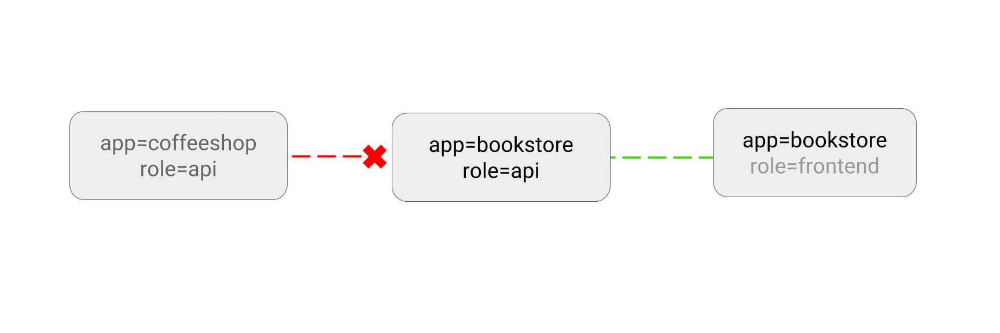

# 限制到一个应用的流量

可以创建网络策略，来允许来自某些 Pod 的流量通过。

## 用例

- 只有选定范围内的服务才能够访问指定服务。

- 只有允许的服务才能够访问数据库



## 示例

假设你的应用是一个 REST API 服务器，使用标签`app=bookstore`和`role=api`进行标识：

~~~sh
kubectl run apiserver --image=nginx --labels app=bookstore,role=api --expose --port 80
~~~

把下面的网络策略保存为`api-allow.yaml`，这个策略只允许符合标签`app=bookstore`条件的Pod发出的流量：

```yaml
kind: NetworkPolicy
apiVersion: networking.k8s.io/v1
metadata:
  name: api-allow
spec:
  podSelector:
    matchLabels:
      app: bookstore
      role: api
  ingress:
  - from:
      - podSelector:
          matchLabels:
            app: bookstore
```

```sh
$ kubectl apply -f api-allow.yaml
networkpolicy "api-allow" created
```

## 测试

要测试策略中隐含的拦截动作，可以运行一个不带有`app=bookstore`标签的 Pod：

~~~sh
$ kubectl run test-$RANDOM --rm -i -t --image=alpine -- sh
/ # wget -qO- --timeout=2 http://apiserver
wget: download timed out
~~~

通信失败了。

接下来测试一下允许通过的流量，从一个`app=bookstore`的 Pod 中发出测试：

~~~sh
$ kubectl run test-$RANDOM --rm -i -t --image=alpine --labels app=bookstore,role=frontend -- sh
/ # wget -qO- --timeout=2 http://apiserver
<!DOCTYPE html>
<html><head>
~~~

可以看到，成功的取得了内容。

## 清理

```sh
kubectl delete deployment apiserver
kubectl delete service apiserver
kubectl delete networkpolicy api-allow
```
