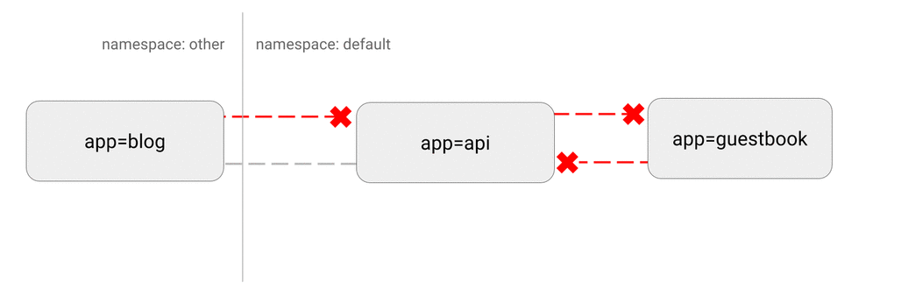

# 拒绝命名空间内所有不符合白名单要求的流量

## 用例

这是一个基础策略，会屏蔽所有白名单之外的 Pod 间通信。

可以考虑将这一策略应用到所有会部署工作负载的命名空间之中（除掉`kube-system`）。

## 最佳实践

这个策略可以作为缺省策略，拒绝所有流量。这样就可以清楚的识别出组件之间的依赖，利用网络策略的定义就能清楚的勾画出组件间的依赖图。



## `default-deny-all.yaml`

```yaml
kind: NetworkPolicy
apiVersion: networking.k8s.io/v1
metadata:
  name: default-deny-all
  namespace: default
spec:
  podSelector: {}
  ingress: []
```

上述文件中有一点新东西：

- `namespace: default` 这一策略将会发布到`default`命名空间。

- `podSelector:` 为空，意思是**匹配所有 Pod**。也就是说这一策略会对`default`命名空间里面的所有 Pod 生效。

- 这里没有定义`ingress`规则，会导致所有以选中 Pod（这里就是所有 Pod）为目标的流量都被丢弃。

  - 本例中可以省略`ingress`字段，或者简单的置为空值：`ingress:`

```sh
$ kubectl apply -f default-deny-all.yaml
networkpolicy "default-deny-all" created
```

## 清理

~~~sh
kubectl delete networkpolicy default-deny-all
~~~