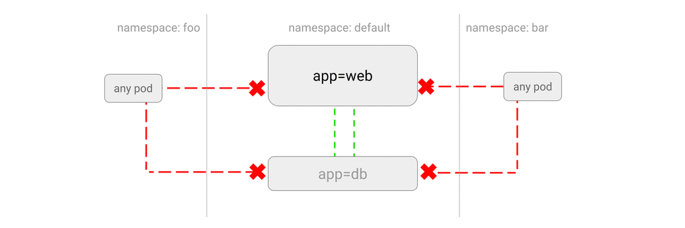

# 拦截所有来自于其他命名空间的流量

> 就是仅限命名空间内的通信

You can configure a NetworkPolicy to **deny all the traffic from other
namespaces while allowing all the traffic coming from the same namespace** the
pod deployed to.

可以配置一个网络策略，**拒绝**所有来自其他命名空间的流量，**允许**所有同一命名空间的访问。

## 用例

- 不想让`test`命名空间的应用访问到`prod`命名空间的数据库或服务。

- 不同客户的应用在不同的 Kubernetes 命名空间中运行，管理员希望禁止各个命名空间之间的互访。




## 示例

创建一个名为`secondary`的命名空间，并在其中运行一个 Web Service：

~~~sh
kubectl create namespace secondary

kubectl run web --namespace secondary --image=nginx \
    --labels=app=web --expose --port 80
~~~

创建文件`web-deny-other-namespaces.yaml`，并提交到集群上：

~~~yaml
kind: NetworkPolicy
apiVersion: networking.k8s.io/v1
metadata:
  namespace: secondary
  name: deny-from-other-namespaces
spec:
  podSelector:
    matchLabels:
  ingress:
  - from:
    - podSelector: {}
~~~

~~~sh
$ kubectl apply deny-from-other-namespaces.yaml
networkpolicy "deny-from-other-namespaces" created"
~~~

上面文件中的几个细节：

- `namespace: secondary`：部署到命名空间`secondary`之中。

- `spec.podSelector.matchLabels`：空值，也就是说对应的目标是这一命名空间中的所有 Pod。
- `spec.ingress.from.podSelector`：空值，允许本命名空间内的所有 Pod 发出的流量。

## 测试


从`default`命名空间调用这一服务： 

```sh
$ kubectl run test-$RANDOM --namespace=default --rm -i -t --image=alpine -- sh
/ # wget -qO- --timeout=2 http://web.secondary
wget: download timed out
```

可以看到来自`default`命名空间的通信被屏蔽了。

而`secondary`命名空间内的通信则是正常的：

```sh
$ kubectl run test-$RANDOM --namespace=secondary --rm -i -t --image=alpine -- sh
/ # wget -qO- --timeout=2 http://web.secondary
<!DOCTYPE html>
<html>
```

### 清理

~~~sh
kubectl delete deployment web -n secondary
kubectl delete service web -n secondary
kubectl delete networkpolicy deny-from-other-namespaces -n secondary
kubectl delete namespace secondary
~~~