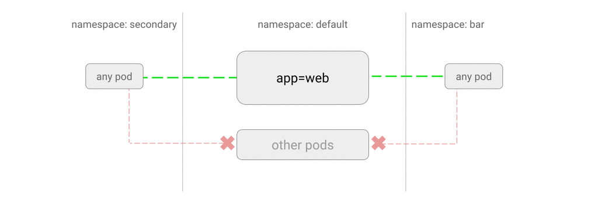

# 允许来自所有命名空间的，目标为某应用的流量

这一策略会允许来自所有命名空间的所有 Pod 发往指定应用的流量。

## 用例

- 为多个命名空间提供服务的通用服务。

如果创建了前面提到的只允许白名单通信、或者屏蔽到一个应用的所有流量的策略，就需要提供这样的一个策略了。
ce.md).

## 示例

创建一个名为`secondary`的命名空间，并在其中运行一个 Web Service：

~~~sh
kubectl create namespace secondary

kubectl run web --image=nginx \
    --namespace secondary \
    --labels=app=web --expose --port 80
~~~

创建名为`web-allow-all-namespaces.yaml`的 YAML 文件，并提交到集群上：

~~~yaml
kind: NetworkPolicy
apiVersion: networking.k8s.io/v1
metadata:
  namespace: secondary
  name: web-allow-all-namespaces
spec:
  podSelector:
    matchLabels:
      app: web
  ingress:
  - from:
    - namespaceSelector: {}
~~~

~~~sh
$ kubectl apply web-allow-all-namespaces.yaml
networkpolicy "web-allow-all-namespaces" created"
~~~

这条策略中的一些细节：

- 只针对`secondary`命名空间中标签为`app:web`的 Pod。

- `namespaceSelector: {}`：来自所有命名空间的所有 Pod。

- 缺省状况下，如果没有指定`namespaceSelector`，就只会选择当前所在的命名空间。

> 注意：如果删掉`spec.ingress.from`的所有内容，就代表了所有命名空间的所有 Pod：
> 
> ...
>   ingress:
>     - from:
>
> 然而，建议书写完整的表达式，从而减少歧义。

## 测试

从`default`命名空间发起查询：

~~~sh
$ kubectl run test-$RANDOM --namespace=default --rm -i -t --image=alpine -- sh
/ # wget -qO- --timeout=2 http://web.secondary
wget: download timed out
<!DOCTYPE html>
<html>
<head>
(works)
~~~

类似的，如果从`secondary`发起，也会有同样结果。

### 清理

~~~sh
kubectl delete deployment web -n secondary
kubectl delete service web -n secondary
kubectl delete networkpolicy web-allow-all-namespaces -n secondary
kubectl delete namespace secondary
~~~