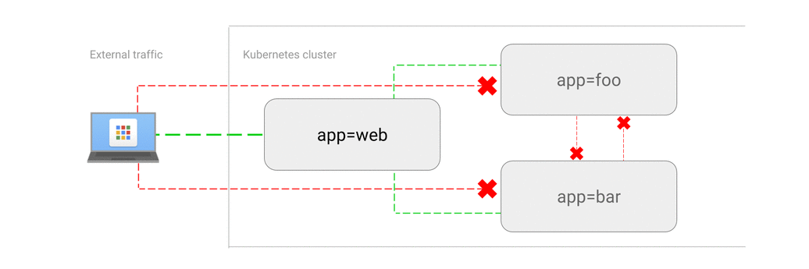

# 允许外部客户端的流量

这条策略让 Pod 允许来自集群外的（公共）网络的直接访问或者负载均衡的访问。

## 用例

- 在一个只允许白名单流量的命名空间中暴露 Pod。

## 示例

运行 Web 服务器，并使用负载均衡方式将其暴露到互联网：

~~~sh
kubectl run web --image=nginx \
    --labels=app=web --port 80

kubectl expose deployment/web --type=LoadBalancer
~~~

使用`kubectl get service`命令，直到获取到外部 IP。

浏览`http://[EXTERNAL-IP]`来确认是否有效。

下面的 `web-allow-external.yaml` 文件允许来自所有来源的访问（不论是内部还是外部），提交到集群：

~~~yaml
kind: NetworkPolicy
apiVersion: networking.k8s.io/v1
metadata:
  name: web-allow-external
spec:
  podSelector:
    matchLabels:
      app: web
  ingress:
  - from: []
~~~

~~~sh
$ kubectl apply -f web-allow-external.yaml
networkpolicy "web-allow-external" created
~~~

用浏览器访问`http://[EXTERNAL-IP]`来检查可访问性。

## 注意

这个规则为`app=web`的 Pod 制定，但是没有定义`podSelector`或`namespaceSelector`，可以被包含外部的所有来源进行访问。

如果只允许访问 80 端口，可以这样定义：

~~~yaml
  ingress:
  - ports:
    - port: 80
    from: []
~~~

## 清理

~~~sh
kubectl delete deployment web
kubectl delete service web
kubectl delete networkpolicy web-allow-external
~~~
