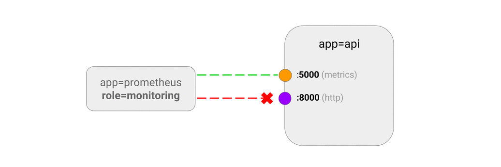

# 只允许目标为指定端口的流量

这一节的策略可以将 Ingress 规则指定到应用的特定端口上。如果没有指定端口，则会对所有端口生效。

## 用例

- 允许监控系统通过对应用程序检测端口的访问来收集指标数据，但是不允许对其他端口的访问。

## 示例

运行一个名为`apiserver`的部署：

~~~sh
kubectl run apiserver --image=ahmet/app-on-two-ports --labels=app=apiserver
~~~

这一应用会监听`http://:8000`，返回一个`hello`作为响应，另外提供了`http://:5000/metrics`给监控系统进行数据采集。

定义服务，将 8000 端口映射为 8001，5000 端口映射为 5001

~~~sh
kubectl create service clusterip apiserver \
    --tcp 8001:8000 \
    --tcp 5001:5000
~~~

>  **注意**
> 网络策略控制的是 Pod 级别的通信，因此他并不关心端口的映射关系，例如本例中的 8001 和 5001。所以定义策略应该使用容器端口（例如本文中的 8000 和 5000）。另外也可以使用端口名称，例如上文中的`metrics`和`http`。

把这条策略保存为`api-allow-5000.yaml`并提交到集群：

~~~yaml
kind: NetworkPolicy
apiVersion: networking.k8s.io/v1
metadata:
  name: api-allow-5000
spec:
  podSelector:
    matchLabels:
      app: apiserver
  ingress:
  - ports:
    - port: 5000
    from:
    - podSelector:
        matchLabels:
          role: monitoring
~~~

~~~sh
$ kubectl apply -f api-allow-5000.yaml
networkpolicy "api-allow-5000" created
~~~

这条策略的作用：

- 丢弃所有白名单外目标为`app=apiserver`的流量。
- 允许同命名空间内标签为`role=monitoring`的 Pod 对 5000 端口的访问

## 测试

运行一个未设置标签的 Pod，观察到 5000 和 8000 端口的访问被屏蔽的情况：

~~~sh
$ kubectl run test-$RANDOM --rm -i -t --image=alpine -- sh
/ # wget -qO- --timeout=2 http://apiserver:8001
wget: download timed out

/ # wget -qO- --timeout=2 http://apiserver:5001/metrics
wget: download timed out
~~~

运行一个带有标签`role=monitoring`的Pod，可以看到他可以访问 5001 端口，但是 8001 还是不可以访问的。

~~~sh
$ kubectl run test-$RANDOM --labels=role=monitoring --rm -i -t --image=alpine -- sh 
/ # wget -qO- --timeout=2 http://apiserver:8001
wget: download timed out

/ # wget -qO- --timeout=2 http://apiserver:5001/metrics
http.requests=3
go.goroutines=5
go.cpus=1
~~~

## 清理

~~~sh
kubectl delete deployment apiserver
kubectl delete service apiserver
kubectl delete networkpolicy api-allow-5000
~~~
