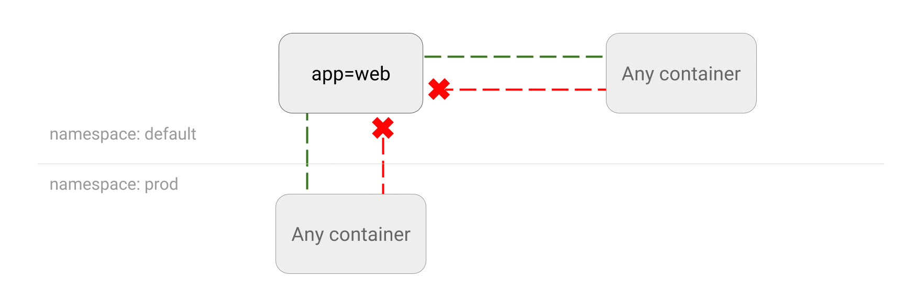

_有了网络策略，你也做得到！_

>你好，经用户投诉，发现此公众号涉嫌违规使用原创声明功能，违反《微信公众平台运营规范》3.6条规定，违规消息《Kubernetes 网络策略示例》已被取消原创标识，请遵守规范，让我们共创健康绿色的运营环境。违规原因：恶意隐藏文字，原创作弊。如有异议，可发起申诉。

# Kubernetes 网络策略指南

这里包含一系列的 [Kubernetes 网络策略](https://kubernetes.io/docs/concepts/services-networking/network-policies/)的相关用例以及相关的 YAML 文件。想要知道如何在 Kubernetes 中对某一应用的流量进行阻拦或者限制，请继续阅读。

尝试网络策略的最简单方法就是创建一个新的 [Google Container Engine 集群](https://cloud.google.com/container-engine)。在现有集群上应用网络策略，可能会造成网络中断。在成文期间，多数云供应商尚未提供内置的网络策略支持。

如果你对网络策略一窍不通，建议首先阅读我的文章：[Securing Kubernetes Cluster Networking](https://ahmet.im/blog/kubernetes-network-policy/)。

## 开始之前

- [创建集群](00-create-cluster.md)

## 基础

- [拦截到一个应用的所有流量](01-deny-all-traffic-to-an-application.md)
- [限制到一个应用的流量](02-limit-traffic-to-an-application.md)
- [允许所有目标为某个应用的流量](02a-allow-all-traffic-to-an-application.md)

## 命名空间

- [拒绝命名空间内所有不符合白名单要求的流量](03-deny-all-non-whitelisted-traffic-in-the-namespace.md)
- [拦截所有来自于其他命名空间的流量](04-deny-traffic-from-other-namespaces.md)
- [允许来自所有命名空间的，目标为某应用的流量](05-allow-traffic-from-all-namespaces.md)
- [允许所有来自于某命名空间的流量](06-allow-traffic-from-a-namespace.md)
- [允许来自某命名空间某些 Pod 的流量](07-allow-traffic-from-some-pods-in-another-namespace.md)
- [限制当前命名空间内到某应用的流量](08-limit-traffic-to-an-application-to-current-namespace.md)

## 控制外部客户端流量

- [允许外部客户端的流量](08-allow-external-traffic.md)

## 进阶

- [只允许目标为指定端口的流量](09-allow-traffic-only-to-a-port-number.md)
- [用多个选择器选择允许通过的流量](10-allowing-traffic-with-multiple-selectors.md)

## 控制外发流量（Egress） 🔥🆕🔥

- [拦截来自某应用的外发流量](11-deny-egress-traffic-from-an-application.md)
- [拦截命名空间内所有白名单之外的 Egress 流量](12-deny-all-non-whitelisted-traffic-from-the-namespace.md)
- 🔜 限制来从指定应用到某些 Pod 的 egress 流量。
- 🔜 只允许目标是命名空间内某 Pod 的流量。
- [拦截外部的 egress 流量](14-deny-external-egress-traffic.md)

-----

## 作者

Ahmet Alp Balkan ([@ahmetb](https://twitter.com/ahmetb)).

Copyright 2017, Google Inc. Distributed under Apache License Version 2.0 ,see [LICENSE](LICENSE) for details.

声明: 这并非 Google 官方文档。

